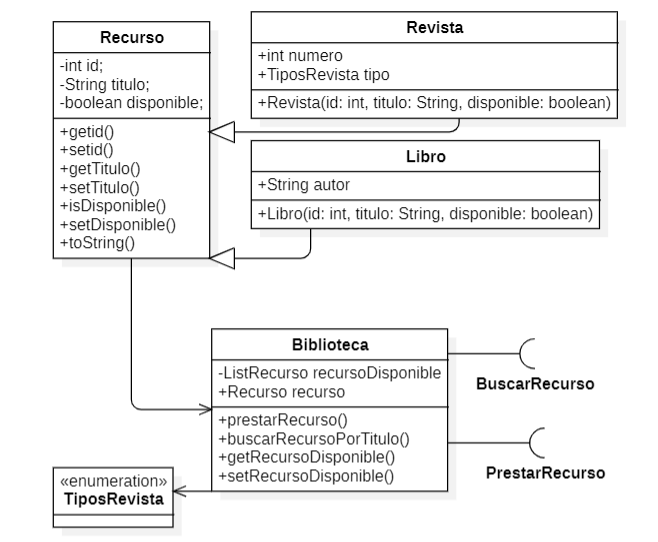
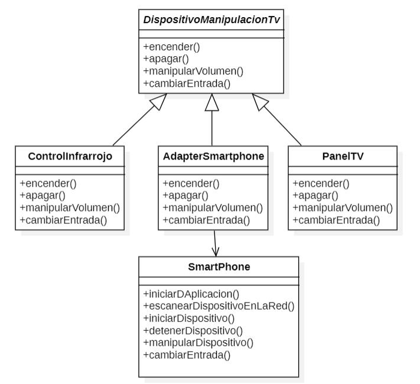

# Segundo reto java

Este repositorio contiene las carpetas `BiliotecaNicolasRuiz` y `PatronesNicolasruiz`

### BiliotecaNicolasRuiz

Esta carpeta contiene los archivos

`Biblioteca.java` - Clase

`BuscarRecurso.java` - Interfaz

`Libro.java` - Subclase

`PrestarRecurso.java` - Interfaz

`Recurso.java` - Clase padre

`Revista.java` - Subclase

`TiposRevista.java` - Emun

`testMain.java` - Clase Main

Estos archivos corresponden al primer ejercicio del reto de Java

El archivo `testMain.java` Es el archivo principal que se ejecuta para verificar el funcionamiento del ejercicio.

#### Diagrama de clases

### PatronesNicolasruiz

Esta carpeta contiene los archivos

`AdapterSmartPhone.java` - Subclase

`Controllnfrarrojo.java` - Subclase

`DispositivoManipulacionTV.java` - Clase Padre Abstracta

`PanelTV.java` - Subclase

`SmartPhone.java` - Clase

`testAdapter.java` - Clase Main

Estos archivos corresponden al segundo ejercicio del reto de Java.

#### Diagrama de clases

